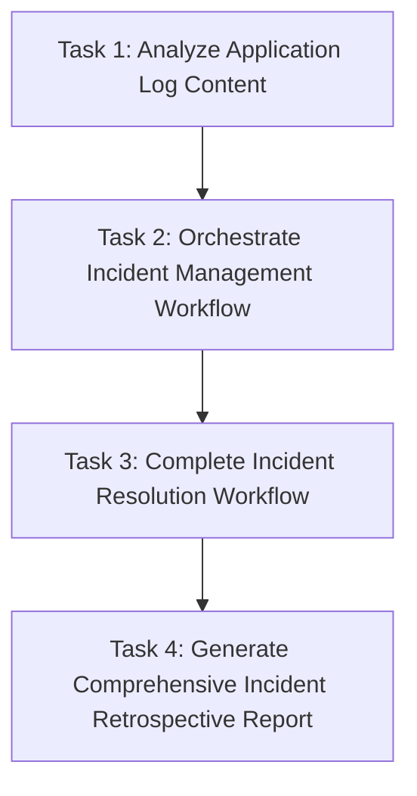

# OpsMindAI Incident Management Automation

## 🎯 Overview

This is a comprehensive incident management automation designed to automatically detect, orchestrate, resolve, and analyze application incidents. The system handles webhook alerts from Grafana, processes log content, creates GitHub PRs for code fixes, and generates professional retrospective reports.

## 🏗️ Architecture Diagram


*Comprehensive incident management workflow showing the interaction between agents, tools, and external systems*

## 👥 Agents & Their Specializations

### 🔍 Alert Detection Agent
**Role**: Front-line incident detection and log analysis  
**Specialization**: Parsing Java application logs and webhook alerts from Grafana

#### 🎯 Core Capabilities:
- Receives webhook alerts from Grafana monitoring systems
- Intelligently parses complex log messages
- Identifies NullPointerException and Configuration issues  
- Classifies incidents with P1/Critical priority
- Extracts detailed incident information (timestamps, stack traces, method names, line numbers)

#### 🛠️ Specialized Tools:
- **`Webhook Alert Parser`** - Processes incoming Grafana webhooks
- **`Application Log Analyzer`** - Parses Java application logs and stack traces

---

### 🎭 Incident Orchestration Manager
**Role**: Central command center for incident workflow coordination  
**Specialization**: Incident ticket management and team coordination

#### 🎯 Core Capabilities:
- Generates structured incident tickets with unique IDs
- Stores incident data in database for tracking
- Creates professional Slack alerts with native formatting
- Coordinates between detection and resolution teams
- Manages incident lifecycle and documentation

#### 🛠️ Specialized Tools:
- **`In-Memory Incident Database`** - Stores and retrieves incident data
- **`Current Date Tool`** - Provides timestamps for incident tracking
- **`Slack Channel Creator`** - Creates dedicated channels for incidents
- **`Slack Message Test Tool`** - Sends professional formatted notifications

---

### 🛠️ Incident Fix Agent
**Role**: Automated incident resolution specialist  
**Specialization**: Code debugging and configuration management

#### 🎯 Core Capabilities:
- Retrieves stored incident data and analyzes root causes
- **For Code Issues (NPE)**: Creates GitHub PRs with proper fixes
- **For Config Issues**: Provides Confluence documentation links  
- Analyzes existing code to understand problematic methods/classes
- Generates detailed fix descriptions and implementation guides
- Communicates resolution progress via Slack

#### 🛠️ Specialized Tools:
- **`In-Memory Incident Database`** - Retrieves incident details
- **`Enhanced GitHub Repository Scanner`** - Analyzes repository structure
- **`GitHub PR Creator`** - Creates pull requests with fixes
- **`Code Diff Generator`** - Generates code changes  
- **`Java NPE Code Diff Generator`** - Specialized NPE fix generation
- **`GitHub PR Test Tool`** - Tests PR creation functionality
- **`GitHub API Debug Tool`** - Troubleshoots GitHub integrations
- **`Slack Message Test Tool`** - Sends resolution status updates

---

### 📊 Senior Incident Retrospective Analyst
**Role**: Post-incident analysis and documentation expert  
**Specialization**: Comprehensive retrospective report generation

#### 🎯 Core Capabilities:
- Extracts incident IDs from previous task outputs
- Retrieves complete incident data from database
- Generates detailed professional reports with extensive analysis
- Creates executive summaries, timelines, root cause analysis  
- Delivers reports via formatted Slack messages AND file attachments
- Serves both executive and technical audiences

#### 🛠️ Specialized Tools:
- **`Incident Retrospective Generator`** - Creates detailed analysis reports
- **`In-Memory Incident Database`** - Retrieves incident data
- **`Incident Report Document Generator`** - Creates Microsoft Word documents
- **`Slack File Uploader`** - Attaches .doc files to Slack channels
- **`Comprehensive Slack Incident Report Formatter`** - Formats messages  
- **`Slack Message Test Tool`** - Sends notifications


## 🔄 Task Workflow & Dependencies



---

## 🧠 Specialized Agents & Tools

| Agent                           | Role/Tools                                                         |
|----------------------------------|--------------------------------------------------------------------|
| **Alert Detection Agent**        | Webhook Alert Parser, Log Analyzer                                 |
| **Incident Orchestration Manager** | In-Memory DB, Slack Channel Creator, Notification Tools           |
| **Incident Fix Agent**           | Repo Scanner, GitHub PR Creator, Diff Generator, NPE Diff Tool     |
| **Senior Incident Retrospective Analyst** | Report Generator, Slack File Uploader, Formatter             |

---

## 📋 Workflow Tasks

1. **Analyze Application Log Content**
   - *Agent*: Alert Detection Agent
   - *Input*: `{log_content}` from webhook (e.g., Java stack trace)
   - *Output*: Structured incident JSON with classification

2. **Orchestrate Incident Management Workflow**
   - *Agent*: Incident Orchestration Manager
   - *Dependencies*: Task 1
   - *Output*: Incident ID, DB storage confirmation

3. **Complete Incident Resolution Workflow**
   - *Agent*: Incident Fix Agent
   - *Dependencies*: Task 2
   - *Output*: GitHub PR creation or Confluence documentation

4. **Generate Comprehensive Incident Retrospective Report**
   - *Agent*: Senior Incident Retrospective Analyst
   - *Dependencies*: Task 3
   - *Output*: Word doc report, file attachment to Slack

---

## 🧰 Tooling Highlights

- **Real-time webhook processing** from Grafana
- **No-hallucination log parsing** and incident classification
- **Automated GitHub PR generation** for code issues
- **Confluence documentation** for config issues
- **Professional Slack notifications** and file attachments
- **Executive & technical reporting** with .docx generation

---

## 🚀 What Sets OpsMindAI Apart?

| Feature                    | Description                                                      |
|----------------------------|------------------------------------------------------------------|
| 🎯 Specialized Agents      | Each agent has a sharply focused role and set of tools           |
| 🔄 Sequential Workflow     | Stepwise, context-rich task orchestration                        |
| 📁 File Generation         | Actual downloadable .docx incident reports                       |
| 💬 Pro Communication       | Native Slack formatting, emojis, and clarity                     |
| 🔧 Code Automation         | Automatic PR creation with code fixes and root cause analysis    |
| 📊 Retrospective Analysis  | 14-section deep-dive report for every incident                   |
| 🎨 Visual Excellence       | Professional formatting for all stakeholders                     |

---

## 📈 Success Metrics

- **Incident detection accuracy**
- **Response time (alert → PR)**
- **File attachment rate**
- **Stakeholder notification coverage**
- **Report generation & delivery**

---

## 🏆 Use Cases

- **Production Incidents:** Auto-detect & resolve code issues
- **Configuration Issues:** Step-by-step remediation with documentation
- **Post-Incident Analysis:** Automated, comprehensive retrospectives
- **Team Communication:** End-to-end Slack notification and reporting
- **Compliance:** Automated documentation for audit and review

---

## ⚙️ Configuration

- **GitHub Integration:** For PR creation and code fixes
- **Slack Workspace Configuration:** For notifications and reporting
- **Target Channel:** `#all-opsmindai`

---

## 🚦 Get Started

1. Set environment variables for GitHub and Slack integration.
2. Configure webhook to receive application logs (e.g., from Grafana).
3. Run the platform and watch incidents detected, resolved, and reported—automatically!

---
## 🚀 Curl
**Pass the input for the agents to kick start**
````curl
curl -X POST http://localhost:8080/webhook/incident-alert \
  -H "Content-Type: application/json" \
  -d '{
  "log_content": "2025-09-15 21:58:30 ERROR [http-nio-8889-exec-1] o.a.c.c.C.[.[.[.[dispatcherServlet] - Servlet.service() for servlet [dispatcherServlet] in context with path [] threw exception [Request processing failed: java.lang.NullPointerException: Cannot invoke \"String.toString()\" because \"risky\" is null] with root cause\njava.lang.NullPointerException: Cannot invoke \"String.toString()\" because \"risky\" is null\n\tat com.ai.mind.ops.DemoController.login(DemoController.java:40)\n\tat java.base/jdk.internal.reflect.NativeMethodAccessorImpl.invoke0(Native Method)\n\tat java.base/jdk.internal.reflect.NativeMethodAccessorImpl.invoke(NativeMethodAccessorImpl.java:77)\n\tat java.base/jdk.internal.reflect.DelegatingMethodAccessorImpl.invoke(DelegatingMethodAccessorImpl.java:43)\n\tat java.base/java.lang.reflect.Method.invoke(Method.java:568)"
}'
````

---

## ❓ FAQ

For frequently asked questions and detailed documentation, please visit:

📋 **[OpsMindAI FAQ & Documentation](https://equinixinc-my.sharepoint.com/:w:/g/personal/rgr_equinix_com/ESRS7M5DAydFjsDL9fnVA1QBARFcWQ34vLkT7iaqNfphVA?e=hYBHD6)**
